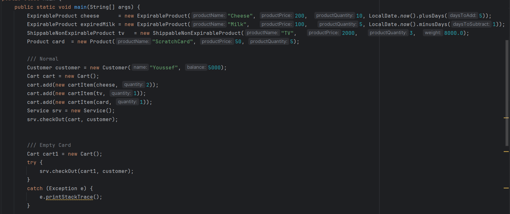
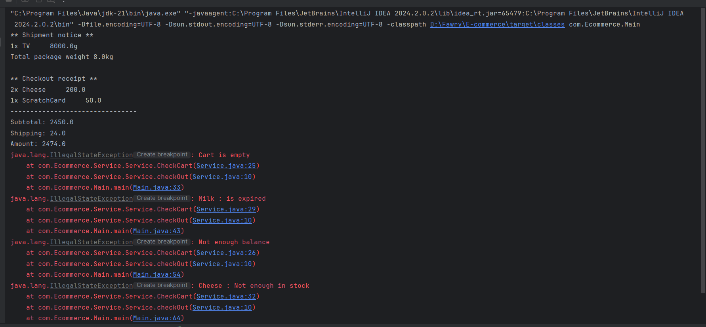

# 🛒 E-Commerce Application

Welcome to the **E-Commerce** application – a Java-based desktop project simulating an online store where users can browse products, add items to the cart, place orders, and manage inventory.

---

## 📦 Features
- 🧾 **Order Management**: Place and manage customer orders.
- 📊 **Inventory Control**: Add, update, or remove products from stock.

---

## 🛠️ Technologies Used

- **Java**

---

## 🚀 Getting Started

1. **Clone the repository**:
   ```bash
   git clone https://github.com/Yousseff-2/E-commerce.git
   cd E-commerce/E-commerce
   ```
2. **Run the project**:
   - Open the project in IntelliJ IDEA or any Java IDE.
   - Compile and run the `Main` class.

---


## Test Cases

**main class all tests**



## output

